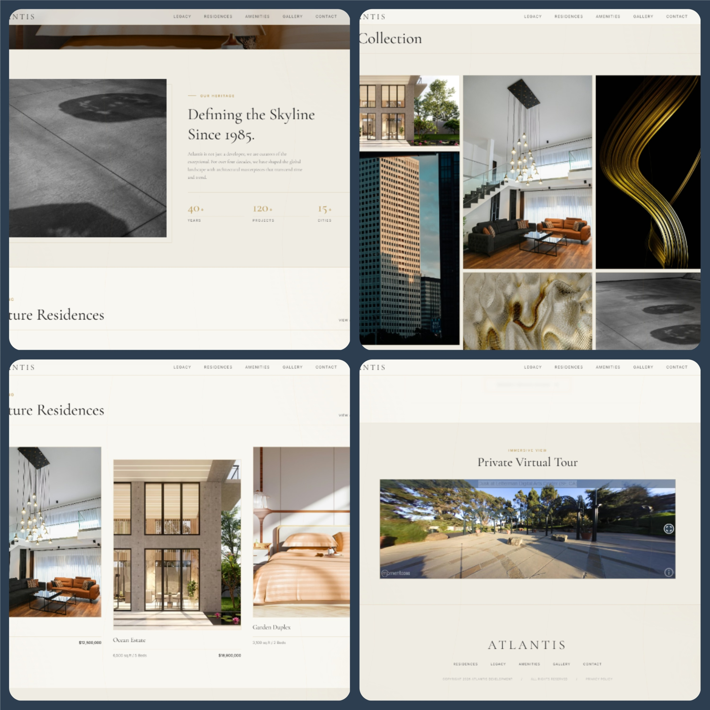
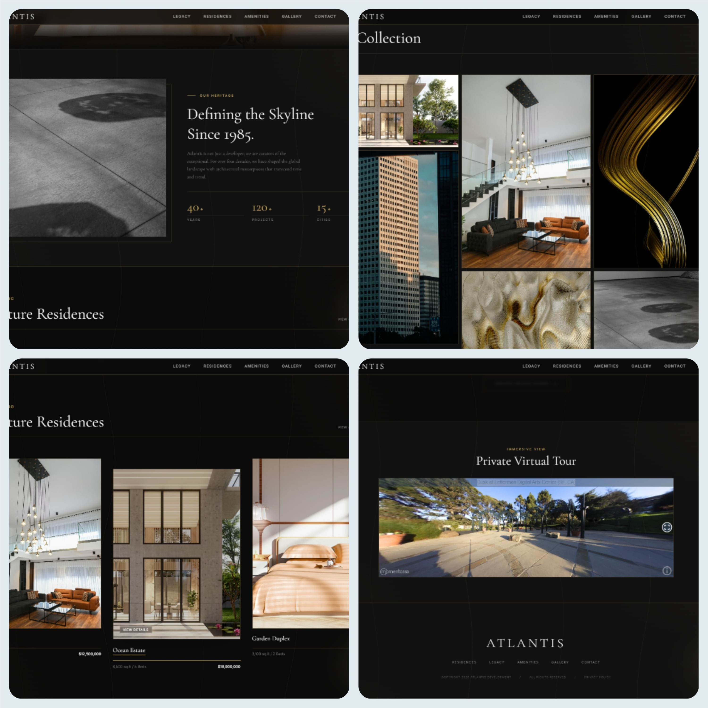

# ATLANTIS – Luxury Real Estate Showcase


A high-end, ultra-minimal, and elegant luxury real estate website designed to showcase signature residences and amenities with a refined, editorial aesthetic. 

Production-ready frontend project built for a real estate client.
---

## Overview

ATLANTIS is a luxury real estate showcase website developed for ATLANTIS PROPERTIES, a real estate developer based in Addis Ababa.

The platform focuses on delivering a refined, editorial-style browsing experience for high-end properties, combining strong visual storytelling with smooth performance.

Key aspects include a modular component architecture, advanced animations, and a consistent theming system supporting both light and dark modes.

---

## **Live Demo**
[Click here](https://atlantis-realestate.vercel.app/) to view live.

---

## **Tech Stack and Tools**

- **React (TypeScript)** – Component-based UI architecture  
- **Vite** – Fast build tool and development environment  
- **Tailwind CSS** – Utility-first styling system  
- **Motion** – Declarative animation library for smooth transitions  
- **Lucide React** – Icon system  
- **Figma** – UI/UX design and prototyping  
- **Momento360** – Embedded AR/360° viewing integration  
- **Vercel** – Deployment and hosting  

---

## **Features**

- **Editorial Browsing:** Magazine-Style Web Design
- **Immersive parallax hero section:** Immersive parallax background with smooth vertical scroll effects.
- **Interactive components:** Interactive property listings with refined hover states.
- **Smooth loading sequence:** Smooth loading sequence to reinforce premium branding.
- **Dynamic theme system (dark/light mode):** Switch seamlessly between dark and light themes.
- **Responsive Design:** Fully responsive across all device sizes.
- **A demo augmented-reality view:** Demo AR experience for spatial visualization (this feature is limited due to lack of usable assets provided)

---

## Architecture

- Built with React (component-driven architecture)
- Animations handled via Motion for smooth, performant transitions
- Global theming managed via CSS variables
- Modular component structure for scalability (Hero, Listings, Loader, etc.)
- Optimized asset loading for performance and smooth UX

---

## Screenshots

### Light Mode Screenshots


### Dark Mode Screenshots


## ⭐ Key Highlights

- A unique and premium UI/UX with strong visual identity
- Smooth, performant animations
- Clean and scalable frontend architecture
- Production-ready deployment on Vercel

---

## 🚧 Future Improvements (Personal recommendations)

- Integrate CMS for dynamic property management
- Add authentication for admin property uploads

---

## **Getting Started**

### **1. Clone the Repository**

```bash
git clone https://github.com/novage-dev/atlantis
```

### **2. Install Dependencies**

```bash
npm install
```

### **3. Run Development Server**

```bash
npm run dev
```

Your website will be available at `http://localhost:5173` (Vite default port).

### **4. Environment Variables**

No environment variables required for this project.

### **5. Build for Production**

```bash
npm run build
```

---

## **Project Structure**

```
src/
├─ app/           # Core application layer
|  ├─ components/           # All React components (Header, Hero, FeaturedResidences, etc.)
|  ├─ context/           # React Context for global state management
|  └─ App.tsx/           # Main entry point; manages the core layout
├─ assets/           # Images and static assets
├─ hooks/           # JS hooks
├─ styles/           # Tailwind CSS and global styles
└─ main.tsx         # Vite entry point
```

---

## **Customization**

- **Theme Colors:** Edit in `styles/theme.css` using CSS variables (`--bg-primary`, `--text-primary`, `--accent-gold`).
- **Hero & Residences:** Replace placeholder images with your own property images.
- **Loading Animation:** Customize the golden glow or timing in `LoadingScreen.tsx`.

---

## **Development**

Website developed and maintained by:

**Novage Developments**

### 👤 Lead Developer & Author:

**Yisakor Eyob**  
Founder, Novage Developments  

- Portfolio: https://yisakor.vercel.app  
- Available for freelance & contract work

---

## 📄 License

This project is provided for portfolio and demonstration purposes only.

All rights reserved. No part of this codebase may be used, copied,
modified, or distributed without explicit permission.

This project may contain client-related work and is not licensed for reuse.
