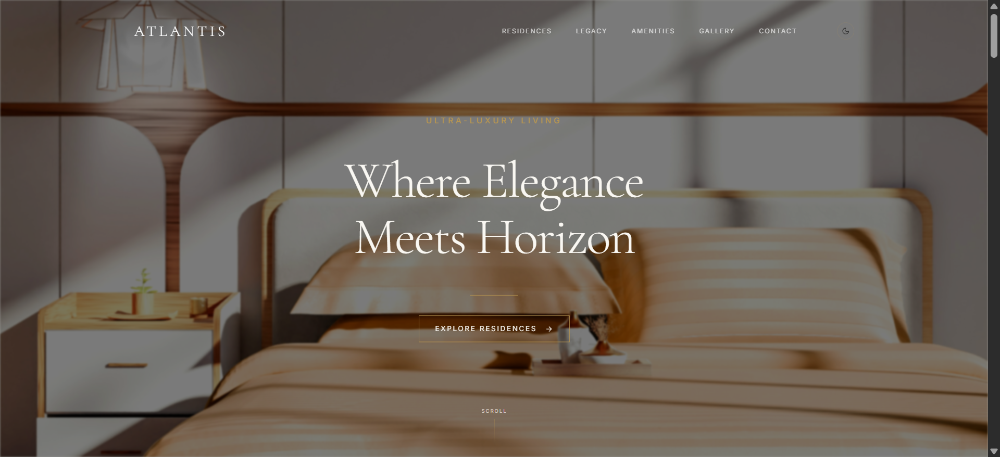

# ATLANTIS – Luxury Real Estate Showcase

A high-end, ultra-minimal, and elegant luxury real estate website designed to showcase signature residences and amenities with a refined, editorial aesthetic. The website features smooth animations, a parallax hero section, and a premium golden-themed loading screen.

---

## **Tech Stack**

- **React** – Frontend library
- **Vite** – Build tool and development server
- **Tailwind CSS** – Utility-first styling
- **Motion** – Animation library for smooth transitions and parallax effects
- **Lucide React** – Icon library

---

## **Features**

- **Hero Section with Parallax:** Immersive hero background with smooth vertical scroll effects.
- **Featured Residences:** Curated property listings with hover interactions and subtle overlays.
- **Loading Screen Animation:** Animated “ATLANTIS” logo with golden glow and sequential letter fade-in.
- **Dark / Light Theme Toggle:** Switch seamlessly between dark and light themes.
- **Responsive Design:** Works across mobile, tablet, and desktop screens.

---

## **Getting Started**

### **1. Clone the Repository**

```bash
git clone https://github.com/novage-dev/atlantis
```

### **2. Install Dependencies**

```bash
npm install
```

### **3. Run Development Server**

```bash
npm run dev
```

Your website will be available at `http://localhost:5173` (Vite default port).

### **4. Build for Production**

```bash
npm run build
```

---

## **Project Structure**

```
src/
├─ app/       # All React components (Header, Hero, FeaturedResidences, etc.)
├─ assets/           # Images and static assets
├─ hooks/           # JS hooks
├─ styles/           # Tailwind CSS and global styles
└─ main.tsx         # Vite entry point
```

---

## **Customization**

- **Theme Colors:** Edit in `styles/theme.css` using CSS variables (`--bg-primary`, `--text-primary`, `--accent-gold`).
- **Hero & Residences:** Replace placeholder images with your own property images.
- **Loading Animation:** Customize the golden glow or timing in `LoadingScreen.tsx`.

---

## **Author**

**Novage Developments**

---

## **License**

This project is for internal use / portfolio purposes and not for public use.
